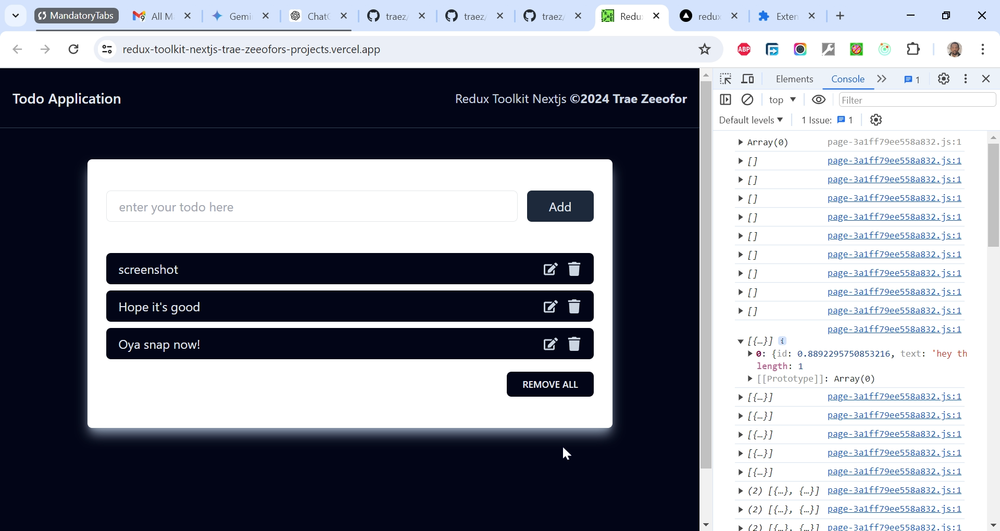

# Redux Toolkit Data Fetching Practice App

This is a solution to [Mastering Redux Toolkit and RTK Query: A Comprehensive Course for State Management & Data Fetching Project](ttps://www.youtube.com/watch?v=CI8VeG0GI-M&t=157s). I'm practicing and developing my coding competency by building projects after projects.

## Table of contents

- [Overview](#overview)
  - [The challenge](#the-challenge)
  - [Screenshot](#screenshot)
  - [Links](#links)
  - [My process](#my-process)
  - [Built with](#built-with)
  - [What I learned](#what-i-learned)
  - [Continued development](#continued-development)
  - [Useful resources](#useful-resources)
  - [Author](#author)
  - [Acknowledgments](#acknowledgments)

## Overview

### The Challenge/User Stories

RTK Query Fundamentals: Explore the powerful capabilities of RTK Query for efficient data fetching in React. Understand how to simplify API calls, manage loading states, and handle caching seamlessly.

### Screenshot

### Links

- Solution URL: [https://github.com/traez/redux-toolkit-data-fetching](https://github.com/traez/redux-toolkit-data-fetching)
- Live Site URL: [https://redux-toolkit-data-fetching-trae-zeeofors-projects.vercel.app/](https://redux-toolkit-data-fetching-trae-zeeofors-projects.vercel.app/)

## My process

### Built with

- Semantic HTML5 markup
- CSS custom properties
- Flexbox and CSS Grid
- Mobile-first workflow
- [React](https://reactjs.org/) - JS library
- [Next.js](https://nextjs.org/) - React framework**
- Tailwind CSS**
- Typescript**
- Nodejs (with/without Expressjs)
- MongoDB**  
- GraphQL**    
- Redux Toolkit 

### What I learned
 
- **createApi**: This function is used to define an API slice in your Redux store. It simplifies setting up API endpoints, managing caching, and handling side effects like loading states and errors.
- **fetchBaseQuery**: This utility function creates a base query function for your API. It uses the Fetch API to make HTTP requests, similar to Axios or other request libraries but tailored to work seamlessly with Redux Toolkit. 
- **reducerPath**: This specifies the key ("products") under which this API slice's reducer will be named and stored in the Redux store (also known as the slice's name). This helps organize and access the state and state updates managed by this slice. 
- **baseQuery**: This property defines the base query function used for making API requests in your API slice.  
- **fetchBaseQuery**: Here, the value assigned to baseQuery is fetchBaseQuery. This is a helper function provided by `@reduxjs/toolkit/query/react`. It simplifies making API requests by leveraging the built-in Fetch API. 
- **baseUrl**: "https://dummyjson.com": This is an object passed as an argument to fetchBaseQuery. It configures the base URL for your API endpoint. In this case, it's set to "https://dummyjson.com". Any API requests made within your defined endpoints will use this base URL as the starting point.
- **endpoints**: This property in the API slice configuration object `(createApi({ ... }))` defines the actual API calls (endpoints) your application will use for interacting with product data. 
- **(builder) => ({ ... })**: This is a builder function provided by createApi. It allows you to create multiple endpoints within your API slice.  
- **getAllProduct**: This line defines a specific endpoint named getAllProduct. It represents an API call to retrieve all products from your backend API. 
- **builder.query**: This method from the builder function is used to define a query endpoint. Query endpoints typically involve GET requests to fetch data.
- **{ query: () => "/products" }**: This object defines the details of the getAllProduct endpoint. The property specifies the function that constructs the query for the API request. In this case, it's a simple arrow function that returns the URL path `/products`. This indicates that the endpoint uses a GET request to retrieve all products from the `/products` endpoint of your API (assuming the base URL is set in the baseQuery configuration). 
- **{ useGetAllProductQuery }**: This is a destructuring assignment that extracts useGetAllProductQuery from the productsApi object. Destructuring is a convenient way to unpack values from objects or arrays into distinct variables. 
- **import { setupListeners } from "@reduxjs/toolkit/query"**: This import brings in the setupListeners utility from Redux Toolkit Query. This utility enhances the store setup by adding the ability to automatically re-fetch data based on certain conditions, such as when the user focuses on the window or reconnects to the internet. 
- **import { productsApi } from "./dummyData"**: This line imports the productsApi object, likely defined in a file named dummyData.js (not shown here). It assumes you've already created the productsApi slice using createApi as explained earlier.
- **[productsApi.reducerPath]: productsApi.reducer** dynamically assigns the productsApi reducer to the Redux store under the key specified by productsApi.reducerPath. This enables the store to manage state for the productsApi slice, which includes handling API data, caching, and other related functionalities provided by Redux Toolkit Query. 
- **middleware: (getDefaultMiddleware) => getDefaultMiddleware().concat(productsApi.middleware)**: This configures the middleware for your Redux store by integrating the middleware specific to the productsApi slice. This middleware enables your application to handle API calls, manage loading states and errors, and update the store with fetched data for product management within your React application using Redux Toolkit Query.
- **setupListeners(store.dispatch)**: This line is vital for enabling data fetching in your Redux Toolkit application using RTK Query. It sets up listeners for API endpoints defined in your slices, allowing components to interact with them using hooks and managing the underlying data fetching logic seamlessly within your store. 
- The **AllProducts** functional component: This component fetches and displays a list of products using the useGetAllProductQuery hook generated by Redux Toolkit Query. It handles three main states: loading, error, and success. When the data is still being fetched (isLoading), it displays a loading message. If there's an error during the fetch (isError), it shows an error message. Once the data is successfully fetched, it maps through the products array from the fetched data and renders each product's title and description. The fetched data and state variables (data, isError, isLoading) are logged to the console and used to conditionally render appropriate content based on the fetch state.
- **Warning: Each child in a list should have a unique "key" prop**: This is a standard React rule. When you use a React fragment (<>...</>) in .map, you'll get this error because the fragment is the outermost element. Add the "key" prop to the fragment or replace the fragment with a div where you can then add the "key" prop.
- The **AddNewProduct** functional component: This component allows users to add a new product. It uses the useAddNewProductMutation hook (likely from `../reduxtk/dummyData.js`) to interact with a Redux Toolkit Query mutation endpoint for adding products. The component handles error and loading states while providing a button to trigger product creation. It attempts to render the newly added product's details (ID, title, description) based on the response data received from the mutation. However, the provided ID (419) might be overridden by a unique ID assigned by the backend during creation. This was confirmed on Postman where the backend returned 195 from a POST request.
- The **UpdateProduct** component: This React functional component allows users to update the details of a specific product by providing a form with fields for the product's title, price, stock, and rating. It uses state variables to manage the input values and leverages the useUpdateProductMutation hook from dummyData to send the updated product data to the server. When the form is submitted, the handleUpdateProduct function constructs an object with the updated details and sends it to the server. The component displays a loading message while the update is in progress and shows the updated product information once the update is successful. 

### Continued development

- More projects; increased competence!

### Useful resources

Stackoverflow  
YouTube  
Google  
ChatGPT

## Author

- Website - [Trae Zeeofor](https://github.com/traez)
- Twitter - [@trae_z](https://twitter.com/trae_z)

## Acknowledgments

-Jehovah that keeps breath in my lungs
